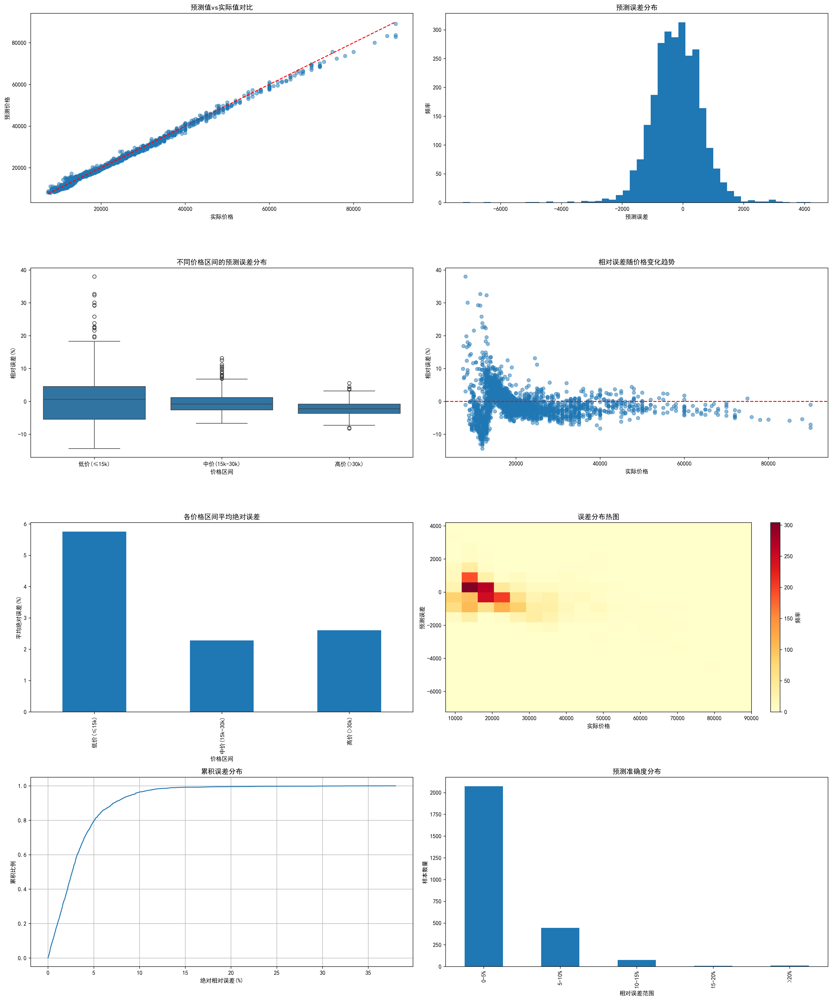

**香港House730房产爬虫项目介绍‌**

本项目旨在利用Python技术栈，实现对香港二手房数据的探索性数据分析

2024/11/1 2:56

更新内容：

模型的调参基本完成，但是在低价区间的房价预测仍有误差（5%），需要进一步思考。

rent.csv是最新清洗过的数据， prediction.py用于模型训练， 想尝试自己分析的， 
使用best_model1.pth进行分析。show.py是模型评估的可视化图表（简陋版）和区间总结（简陋版）可以自己跑一下。

任务(大家认领一下)：

1.了解代码中的各种评估参数，收集相关文献作为引用。

2.可视化界面设计，qt5或者flask(有经验的可以搞一下，算是个任务，如果都没经验就扔给我)。

3.可视化图表设计，用于可视化界面的展示以及presentation的PPT，需要深入了解下模型和数据。

4.report撰写（需要有可视化界面图、可视化图表、相关文献引用）（先写主要报告，等其他人做完了直接插图）。

5.presentation所用的PPT，这个分别跟每个人交流，PPT内容如上述1234。

**总结**

现在模型预测效果已经不错了，进一步优化也是在低价格区间，先把基本的任务都完成还有时间的话可以一起讨论一下。

presentation除了我完成的部份外大家分别负责（文献查阅思路收集、UI界面设计、数据图表分析、论文撰写、PPT制作），最后视情况把测试任务分给分给工作量相对少的盆友，不至于presentation没有东西讲解。

思路暂时如上，想好做什么任务记得在群里一发，有什么问题多沟通交流。
